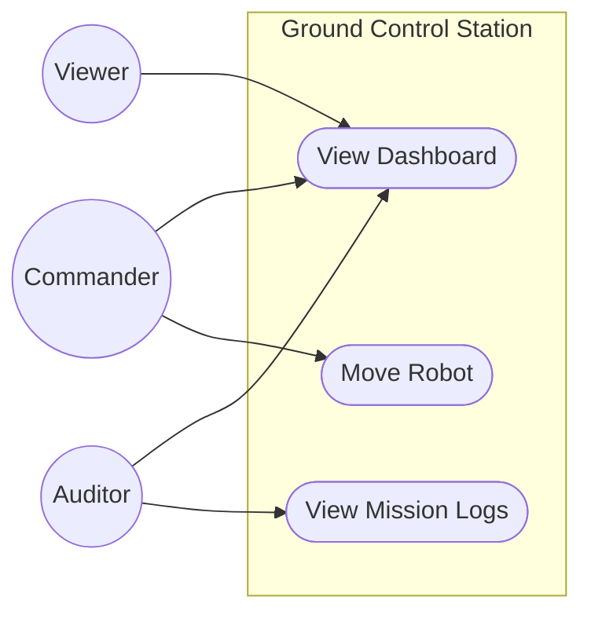
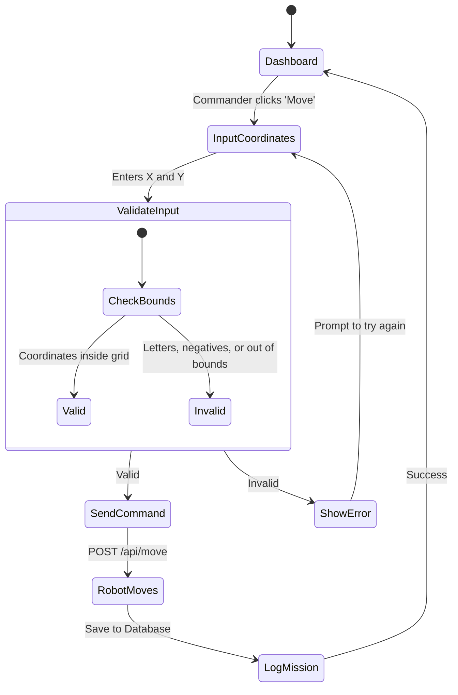
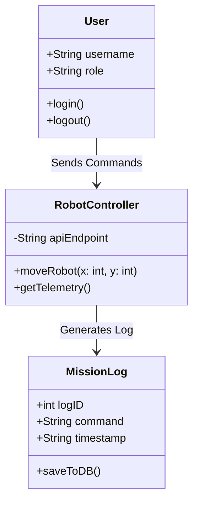
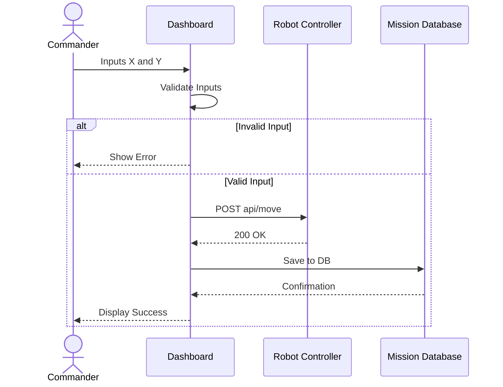

```mermaid
flowchart LR
    %% Actors
    Commander((Commander))
    Viewer((Viewer))
    Auditor((Auditor))

    %% System Boundary and Use Cases
    subgraph Ground Control Station
        ViewDash([View Dashboard])
        Move([Move Robot])
        ViewLogs([View Mission Logs])
    end

    %% Access Rights
    Commander --> ViewDash
    Commander --> Move
    
    Viewer --> ViewDash
    
    Auditor --> ViewDash
    Auditor --> ViewLogs
```

### 2. Activity Diagram: Moving the Robot

```mermaid
stateDiagram-v2
    [*] --> Dashboard
    Dashboard --> InputCoordinates : Commander clicks 'Move'
    InputCoordinates --> ValidateInput : Enters X and Y
    
    state ValidateInput {
        [*] --> CheckBounds
        CheckBounds --> Valid : Coordinates inside grid
        CheckBounds --> Invalid : Letters, negatives, or out of bounds
    }
    
    ValidateInput --> SendCommand : Valid
    ValidateInput --> ShowError : Invalid
    
    ShowError --> InputCoordinates : Prompt to try again
    
    SendCommand --> RobotMoves : POST /api/move
    RobotMoves --> LogMission : Save to Database
    LogMission --> Dashboard : Success
```
### 3. Class Diagram: System Architecture

```mermaid
    classDiagram
    class User {
        +String username
        +String role
        +login()
        +logout()
    }

    class RobotController {
        -String apiEndpoint
        +moveRobot(x: int, y: int)
        +getTelemetry()
    }

    class MissionLog {
        +int logID
        +String command
        +String timestamp
        +saveToDB()
    }

    %% Relationships
    User --> RobotController : Sends Commands
    RobotController --> MissionLog : Generates Log
```

### 4. Sequence Diagram: System Communication

```mermaid
sequenceDiagram
    actor C as Commander
    participant D as Dashboard
    participant R as Robot Controller
    participant M as Mission Database

    C->>D: Inputs X and Y
    
    %% Dashboard checks safety rules first
    D->>D: Validate Inputs
    
    alt Invalid Input
        D-->>C: Show Error
    else Valid Input
        %% Send command to the robot
        D->>R: POST api/move
        R-->>D: 200 OK
        
        %% Save the secure log
        D->>M: Save to DB
        M-->>D: Confirmation
        
        %% Tell the user it worked
        D-->>C: Display Success
    end
```